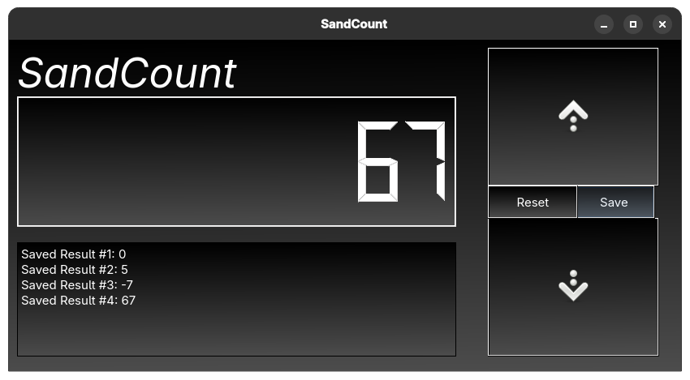

# sandcount
A simple countup app, themed after eyemint (my design language)
## Screenshots

## Installation
Run the install.sh script or run the following in the terminal

`sudo curl https://raw.githubusercontent.com/ActuallySandPotNoodles/sandcount/refs/heads/main/install.sh | sudo bash`

For aarch64 devices (example: Samsung Galaxy tab A8 (2015) running postmarketOS)

`sudo curl https://raw.githubusercontent.com/ActuallySandPotNoodles/sandcount/refs/heads/main/install_aarch64.sh | sudo bash`

The install script will have to be run as root because it places files into the /usr directory
## Building
`pip install pyqt6`

`pyinstaller --onefile sandcount.py`

Then place the files in the correct places:
sandcount.png in `/usr/share/sandpotnoodles/sandcount.png`
sandcount.desktop in `/usr/share/sandpotnoodles/sandcount.desktop`

## Usage
You'll 100% figure it out, trust me
